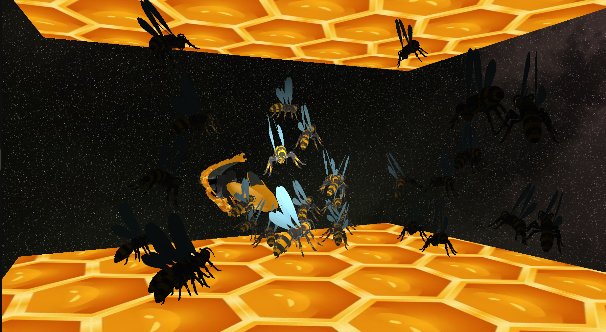

# Komande:

* `space` - pomeranje za 1.0f u smeru Y+
* `left ctrl` - pomeranje za 1.0f u smeru Y-
* `b` - paljenje i gašenje Blinn-Phong modela osvetljenja
* `wasd` - pomeranje kamere
* `mouse scroll` - zoom
* `hold left shift` - zaustavljanje kamerinog praćenja kursora

# Implementirane dodatne oblasti:
`Grupa A: cube mapping`

# Licence:
**[Robo-wasp model](https://sketchfab.com/3d-models/robo-wasp-527c4b30ee7f40bbbb8ed64475b6c835)**

**[Skybox stranice pozajmljene sa datog projekta](https://github.com/matf-racunarska-grafika-galerija/OpenGL_matf_project/tree/main/resources/textures)**

**[Bee hover model](https://sketchfab.com/3d-models/bumble-bee-hover-craft-21234354d78f4a53a5786e1f5a5e764b)**

# Uputstvo
1. `git clone https://github.com/matf-racunarska-grafika/project_base.git`
2. CLion -> Open -> path/to/my/project_base
3. Main se nalazi u src/main.cpp
4. Cpp fajlovi idu u src folder
5. Zaglavlja (h i hpp) fajlovi idu u include
6. Šejderi idu u folder shaders. `Vertex shader` ima ekstenziju `.vs`, `fragment shader` ima ekstenziju `.fs`
7. ALT+SHIFT+F10 -> project_base -> run

Skelet koriscen u projektu je https://github.com/matf-racunarska-grafika/project_base.git

# Galerija:

